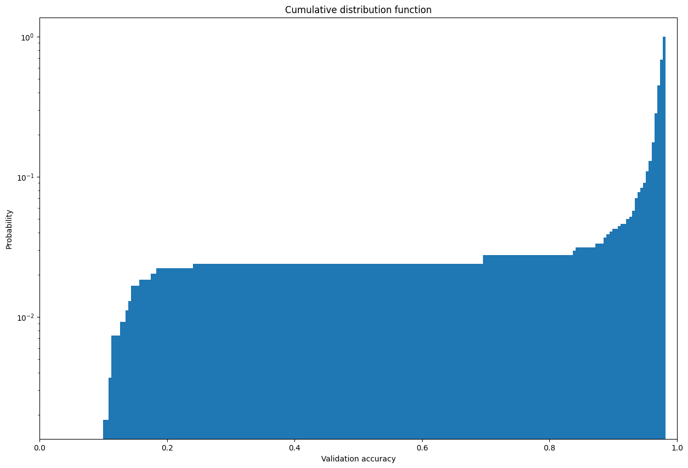
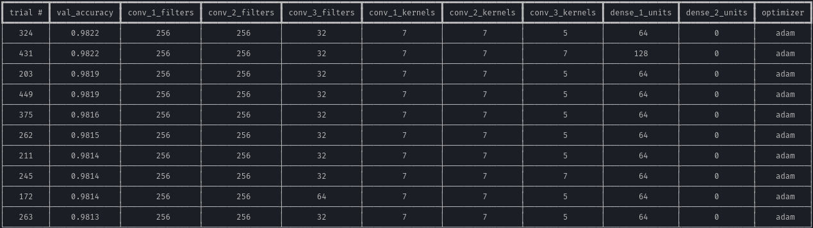
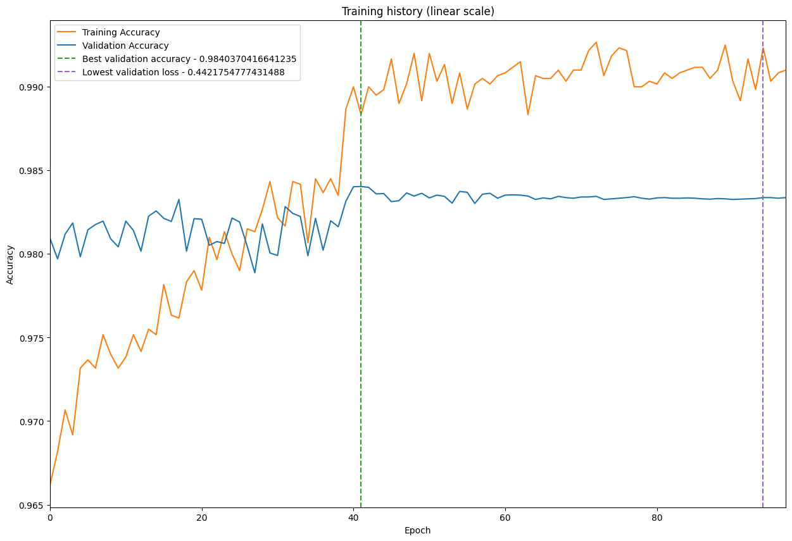
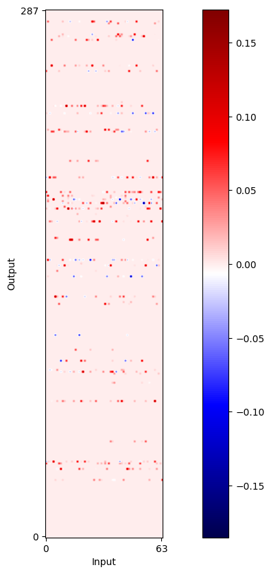
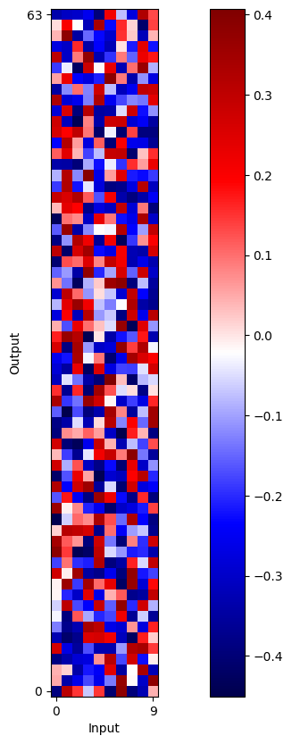
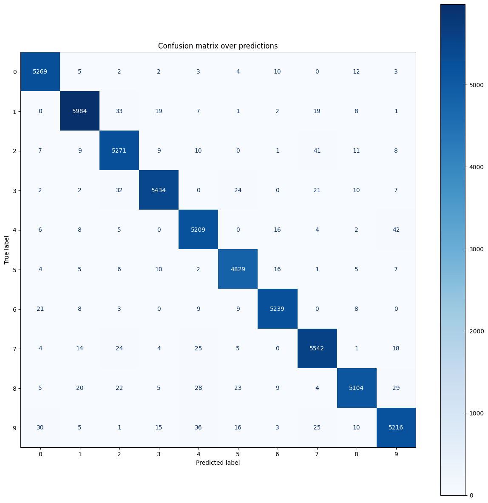
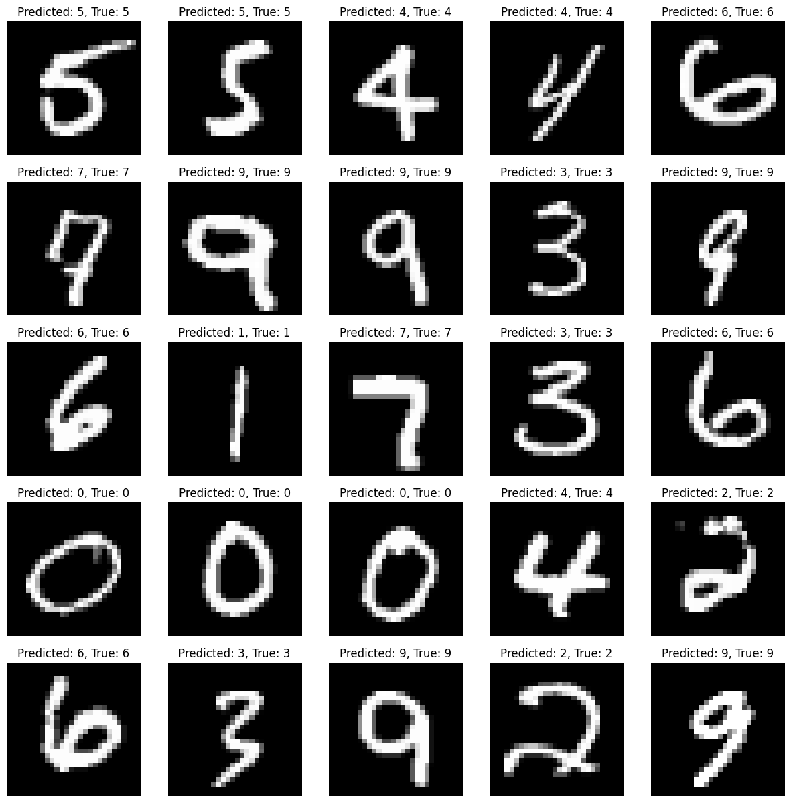
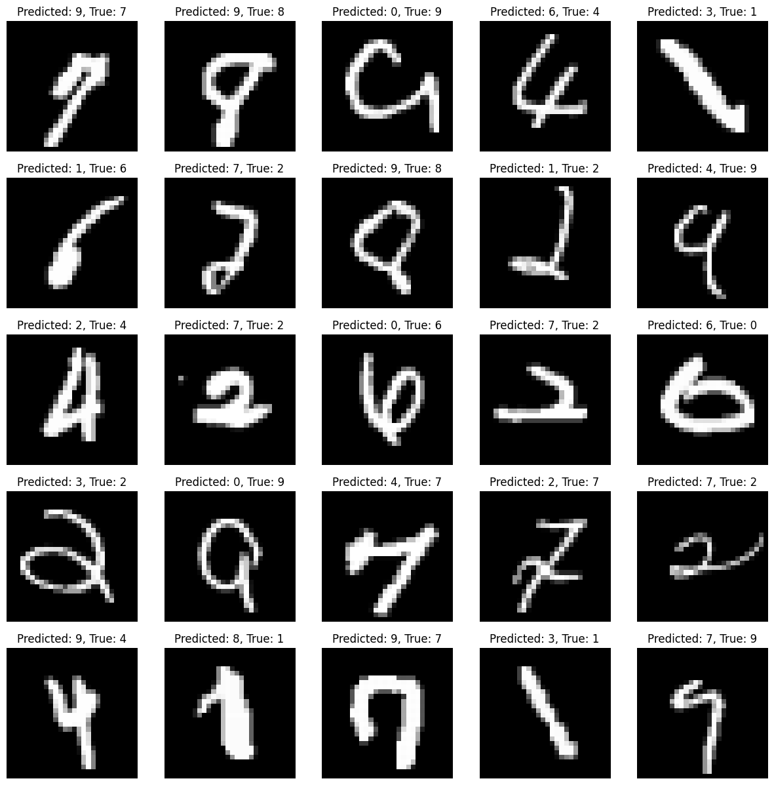

# MNIST Model Creation - Or how I stopped worrying and started loving the tuner

> Why use a pre-made model, trusting the internet, when you can leave your computer on for 3 days straight and make your own?

## Some background about me

I am a *Computer Science and Engineering* student at Politecnico di Milano, and this semester I took the *Artificial Neural Network and Deep Learning* (ANNDL) course taught by Professors Matteo Matteucci and Giacomo Boracchi.

**I was looking very forward to attending this course** since I wanted to understand how neural networks work to finally be able to experiment with them. In the past I tried multiple times to learn about this topic on my own, looking at online tutorials, articles, and videos; I however always found them lacking in many different ways: they were either too superficial *(for people who knew nothing about computers)* or too technical *(and assumed you had at least some knowledge of the topic)*, with **nothing in between**.

After completing the two projects and taking the written exam, I was left with enough knowledge and willingness to try and make something on my own. I didn't (and still don't) really know what I wanted to do, so I opened up [Kaggle](https://www.kaggle.com) and tried looking at datasets. I quickly found that the most common type of problem regarding deep learning was, unsurprisingly, computer-vision-related.

Many of the challenges award **a lot of money** to the winners, and this scared me into not wanting to participate in them. How can I, a measly university student who just learned the basics of neural networks, compete with people who have been working in the field for years? Also, my training hardware amounts to a single laptop with a slightly-above-average GPU, so training on huge amounts of data would take way too long.

I then decided to take a step back and try something simpler. Here Kaggle helped me a lot: the website provides *"beginner"* challenges, without a real prize or scoreboard. They are meant to learn the basics, gain confidence with the platform *(and eventually cave in a give Google a lot of money to rent their TPUs)*. After some scrolling, I found a problem that had been previously introduced in the course and that I was somewhat familiar with *(and I knew I would have been able to solve)*: the [MNIST digit recognizer](https://www.kaggle.com/c/digit-recognizer) challenge.

So I thought: *why not try this, work my way up to the more challenging problems, and document the journey?* Well, **this is the result of that thought**.

### Why I wanted to make this

As soon as I decided that I wanted to try this challenge, I started looking online for a few possible approaches and how the problem was solved. This is seen as a **really basic problem**, nowadays easily solvable with less than an hour of training on a simple model: this is why many websites and blog posts have been written about it.

Of course, I knew *(once again, via the lessons)* that the problem is quite easily solved by using a CNN *(Convolutional Neural Network)* composed of a few convolutional layers interleaved by pooling layers, followed by a few *(if not just one)* fully-connected layers. But the perfectionist in me asked: *am I really sure that this is the best way to solve this problem? Which is the best combination of number of filters, kernel size, dense layers, optimizer, activation function, and so on?.*

Google didn't help me either. A quick search for "MNIST model" returned the following results:

- The [Tensorflow documentation](https://www.tensorflow.org/datasets/keras_example) describes a **simple model**, with only one hidden dense layer with 128 neurons
- This [article by Towards Data Science](https://towardsdatascience.com/solve-the-mnist-image-classification-problem-9a2865bcf52a) describes an equally **simple model**, with only one hidden dense layer with 512 neurons
- This [article found on Machine Learning Mastery](https://machinelearningmastery.com/how-to-develop-a-convolutional-neural-network-from-scratch-for-mnist-handwritten-digit-classification/) defines a model with a **convolutional** layer with 32 filters, a max pooling layer, and a hidden dense layer with 100 neurons
- This [article by Medium](https://selectstar-ai.medium.com/what-is-mnist-and-why-is-it-important-e9a269edbad5) **mirrors the previous one** (exactly)

I have never been satisfied with a *"trust the process in my blog post"* approach; at the same time, I wanted to document the development and the results, so that I could look back at them in the future and maybe help someone else.

So, which model is the best? **My new **objective was to find it out**.**

## What exactly is MNIST?

The **MNIST** *(Modified National Institute of Standards and Technology)* **dataset** is a humongous collection of 70.000 images of handwritten digits, each one labelled with the corresponding numbers. Each image is 28x28 pixels, anti-aliased and greyscale.


The challenge is to create a model that, **given an image**, can correctly **predict the number written** in it. As stated before, this is a very simple problem, solved multiple times already; see [Criticism of the MNIST dataset](#criticism-of-the-mnist-dataset) section to read more *ramblings* about this.

The output is a vector of 10 numbers, each in range [0, 1], that represent the probability of the corresponding digit being the one represented in the input image. The objective of the model is to maximize the accuracy of the prediction, i.e. *the number of times the model correctly predicts the number*.

With this in mind, I fired up VScode, installed the required modules *(honourable mentions to [Tensorflow](https://www.tensorflow.org/) and [Keras](https://keras.io/), as always)* and started coding.

## Data preparation

The dataset is provided by [Tensorflow itself](https://www.tensorflow.org/datasets/catalog/mnist), so I didn't have to download every single image and label. The dataset is already split into a default training set of 60.000 images and a default test set of 10.000 images; since I wanted to be able to set the ratio of those two sets, I had to provide a parameter to the function that loads the dataset.

Furthermore, it seems that **TensorFlow does not foreshadow the possibility of using a validation set**. I don't really know why; this lack of a feature confused me when I started dipping my toes in this topic *(the projects in the course)* and I still don't understand why it is not used.
Luckily it takes about 5 lines of code to achieve such a thing.

After loading and splitting the dataset, the obtained sets contain:

- 6000 images for the **training set**;
- 54000 images for the **validation set**;
- 10000 images for the **test set**.

Each set is composed of two arrays: one containing the images, and one containing the labels. The images are represented as 28x28 matrices of integers in the range [0, 255], while the labels are represented as integers in the range [0, 9].


The distribution of the classes in the sets is shown in the following graph.


The sets have been then **normalised** in range [0, 1]; the training and validation sets have been also batched. To further balance the classes, I computed **class weights** and used them during training.


## Model creation and tuning

Thanks to the lessons and the previous experience, I knew that my model needed:

- An **input** layer;
- **Three convolutional layers**, with a certain number of filters and kernel size;
- Some **pooling layers** to interleave the convolutional ones;
- Some *(either one or two)* **dense layers**, with a certain number of neurons;
- An **output** layer;

The input and output layers are very straightforward: the input layer has to have the same shape as the input images (28x28), while the output layer must have 10 neurons, one for each class; the activation function of the output layer is `softmax`, since a probability distribution is required. To try and reduce overfitting, I also included a **dropout layer** after the first dense layer.

This left me with a lot of choices to make:

- **How many filters** should I use for each convolutional layer?
- What should be the **kernel size** of each convolutional layer?
- How many **dense layers** should I use?
- How many **neurons** should I use for each dense layer?
- Which **optimizer** should I use?

Initially, I narrowed down the choices to:

- One between *[32, 64, 128, 256]* **convolutional filters** for each convolutional layer;
- One between *[3, 5, 7]* as **kernel size** for each convolutional layer;
- One between *[1, 2]* **dense layers**, each one with one between *[64, 128, 256, 512]* **neurons**;
- One between *[Adam, Nadam, Adadelta]* as **optimizer**.

The choice of convolutional filters, kernel sizes, dense layers, and neurons was based on previous experience and research on similar solutions; the choice of the optimizer was based on the [Tensorflow documentation](https://www.tensorflow.org/api_docs/python/tf/keras/optimizers), showing that those three are the most used ones for this kind of problem.

This combination of parameters resulted in **82944 different models**: way too many to try them all or even a small subset of them with a relevant number of epochs. Thankfully, I am not the first person facing this problem and a very valid solution has been proposed: [Keras Tuner](https://keras-team.github.io/keras-tuner/).

If not for this module, one would have to try some parameters, write down the results, and try again with some other parameters. So, un-ironically: *thanks, Google*.

### Keras Tuner

**Keras Tuner** is a module that allows one to automatically search among the space of all the combinations of specified hyperparameters *(the aforementioned 82.944)* finding the best one in the allotted time.
It can implement many different search algorithms, but the one that I found most interesting is the [**Bayesian Optimization**](https://keras.io/api/keras_tuner/tuners/bayesian/).

It works by searching a subset of the space of hyperparameters, evaluating the performance of each model, and using the results to decide which actions to take next. This allows one to find the best model in a reasonable amount of time, without having to try all the possible combinations.

I decided to let the model search for as long as needed *(setting the `max_epochs` parameter as `None`)*, with a maximum of 20 epochs per model, aiming for the highest value of **accuracy**. After about 72 hours of training, interrupted a few times by manual intervention and some memory allocation problems, the model **stalled at about ~99.8% accuracy**.


Apart from the first few models, the accuracy quickly reached a plateau, further evidenced by the following graph with a **logarithmic scale**.


The **distribution of the accuracy** of the models is shown in the following graph.



The tuner was far from finished, but I decided to stop it anyway after 550 trials. The code contains a tool to show in tabular form the best 10 and worst 10 models. They are shown in the following paragraphs.

#### 10 best models



The top 10 models are **all very similar**, with the **optimizer** being *"adam"*, **256 filters** for the **first two convolutional layers**, **128** for the **last** one. The kernel size is **7** for the **first two** convolutional layers and **5** for the **last** one. All of them have only **one dense** layer, with all but one having **64** neurons.

The tuning process also **repeated multiple times** the same model *(for example, the first and the third best results)*. I was not able to find out why this happened, but I suspect it is due to the fact that the exploration of the hyperparameters space had already reached its end but **the tuner failed to end**.

#### 10 worst models


All the worst 10 models share the same optimizer.

They don't share much of the other hyperparameters; this leads me to believe that these hyperparameters are not relevant when compared to the optimizers.

### Chosen model

The **model that I chose** was the one found in **trial 324**, having:

- **2 convolutional layers**, with **256 filters** and a **kernel size of 7**;
- **1 convolutional layer**, with **32 filters** and a **kernel size of 5**;
- **1 dense layer**, with **64** neurons;
- **adam** as optimizer.

The model features a total of *3450478* parameters, out of which *3449388* are **trainable**:

```plaintext
_________________________________________________________________
 Layer (type)                Output Shape              Param #
=================================================================
 input (InputLayer)          [(None, 28, 28, 1)]       0

 batch_normalization (Batch  (None, 28, 28, 1)         4
 Normalization)

 conv_1 (Conv2D)             (None, 28, 28, 256)       12800

 max_pool_1 (MaxPooling2D)   (None, 14, 14, 256)       0

 batch_norm_1 (BatchNormali  (None, 14, 14, 256)       1024
 zation)

 conv_2 (Conv2D)             (None, 14, 14, 256)       3211520

 max_pool_2 (MaxPooling2D)   (None, 7, 7, 256)         0

 batch_norm_2 (BatchNormali  (None, 7, 7, 256)         1024
 zation)

 conv_3 (Conv2D)             (None, 7, 7, 32)          204832

 max_pool_3 (MaxPooling2D)   (None, 3, 3, 32)          0

 batch_norm_3 (BatchNormali  (None, 3, 3, 32)          128
 zation)

 flatten (Flatten)           (None, 288)               0

 dense_1 (Dense)             (None, 64)                18496

 dropout (Dropout)           (None, 64)                0

 dense_out (Dense)           (None, 10)                650

=================================================================
Total params: 3450478 (13.16 MB)
Trainable params: 3449388 (13.16 MB)
Non-trainable params: 1090 (4.26 KB)
_________________________________________________________________
```

The model summary is shown in the following image.


### Intermezzo - I forgot the first rule of deep learning

I was **very happy with the results of the tuner**, but I was expecting a better overall accuracy *(at least something closer to 99.9%)*. Then I remembered:

> You can't achieve 100% accuracy.

Yet I tried so hard. This was apparent to me **only after the [model evaluation](#model-evaluation) phase**, when I started looking at the misclassified images.

### Training the model

The model was trained with an initial learning rate of *0.001*, using the `Adam` optimizer, with a batch size of 128 and a maximum of 200 epochs. The metric used was the `sparse_categorical_accuracy` on the validation set.

To prevent **overfitting** and **vanishing gradient** issues, the following techniques were used:

- **L1L2 weights regularization** on all layers;
- **Dropout** on the dense layer;
- **Glorot normal initialization** on all layers;
- **Early stopping** with a patience of 10 epochs;
- **Learning rate reduction on a plateau** with a patience of 4 epochs and a factor of 0.1.



As can be seen from the graph, the **model training reached a plateau** *(and the best validation accuracy)* at about *40 epochs*, with an accuracy of about *99.8%*.

#### Layer weights

**Just for fun**, I decided to visualize the weights of the convolutional and dense layers. I was kind of **expecting to see some patterns**, but I was not able to find much of them. The scale of the weights is not really that important; this is just a *(rather silly)* way of visualizing them.

##### Convolutional layers

The **kernel weights of the convolutional layers** are shown in the following images.


##### Dense layers

The **weights of the dense layers** are shown in the following images. These images are not really that interesting, since they are just a bunch of (almost) random numbers.





## Model evaluation

### Metrics

The model was **evaluated on the test set**, according to the following metrics:

- **Accuracy**: $\frac{TP + TN}{TP + TN + FP + FN}$
- **Precision**: $\frac{TP}{TP + FP}$
- **Recall**: $\frac{TP}{TP + FN}$
- **F1** score: $2 \cdot \frac{precision \cdot recall}{precision + recall}$

Where:

- $TP$ is the **number of true positives** *(i.e. the number of correctly classified images)*;
- $TN$ is the **number of true negatives** *(i.e. the number of correctly rejected images)*;
- $FP$ is the **number of false positives** *(i.e. the number of incorrectly classified images)*;
- $FN$ is the **number of false negatives** *(i.e. the number of incorrectly rejected images)*.

The values of the metrics are shown in the following table.

| metric   | value    |
| :--------: | :--------: |
| Accuracy | 0.9832777777777778 |
| Precision| 0.9832502222742707 |
| Recall   | 0.9832964008671585 |
| F1       | 0.9832618611168126 |

### Confusion matrix

To further highlight the performance of the model, the **confusion matrix** is shown in the following image.



There is not much to say about the confusion matrix; the model is pretty good at classifying the images, with very few misclassifications.

### Correctly classified images

In the following images, some of the **correctly classified digits** are shown.



### Misclassified images

In the following images, some of the **misclassified digits** are shown.



This is what I was talking about when I said that [I forgot the first rule of deep learning](#intermezzo---i-forgot-the-first-rule-of-deep-learning): some images **are really hard to classify**, even for a human. It would be possible to achieve a higher accuracy by **aggressively overfitting the model**, which clearly is not a good idea.

To try and understand why the model misclassified those images, I decided to plot some of the output probabilities of some inputs; the results are shown in the following images.


As it can be seen, **the model is both times very confidently incorrect**. After a further analysis of the misclassified images, I realized that the source of this problem could be attributed, at least partially, to the **lack of data augmentation**.

I will talk more about this in the [Data augmentation](#data-augmentation) paragraph.

## Final thoughts

After about a week of **on-and-off training and tuning**, I was quite happy with the results.

Not because of the model result *(which, as I said, is not that impressive)*, but because I completed a deep learning model by myself, documenting the process and the results.

With some hindsight, I would have done some things **differently**, such as:

- Don't include more than one dense layer for the tuning process, as I was quite sure it would have been useless and it would have only increased the number of models to try;
- Use data augmentation *(but more on this later)*.

All the code is available on the repository in the `model.py` file; feel free to use it as you wish.

### Data augmentation

**Data augmentation** is seen as a fundamental part of the development of a model, especially when the dataset is not big or varied enough. It is used to **artificially increase the size of the dataset**, by applying transformations to the images.

Random noise can be added to the images, thus making the model more robust. In this particular case, however, I don't think it would have helped much since the **images are all quite clean and sharp.** The same goes for random rotations, zooms, and shifts: **the images are all centred and relatively well-aligned**, so I don't think it would have helped much.

Other techniques, such as cutmix, mixup, rotation, and flipping, would have been detrimental to the model: since the set contains **handwritten digits**, it is not possible to rotate or flip them without changing their meaning; the same goes for **mixing**, since it would have created images without any real meaning.

On the first round of tuning, I included **data augmentation in the form of salt and pepper noise**; **this did **not translate **into** any improvement** over the validation set**, so I decided to remove it. In hindsight, I could have left it in, since it would have been a good way to test the robustness of the model.

Just to prove

### What next?

After completing this *(trivial)* problem, I am left with a lot of **confidence in future projects**.

The next fields that I would like to explore are **image segmentation and object detection**. The only thing that is stopping me is that I would like to create a *(relatively)* useful model, and I might have to create a custom dataset for that. I am also thinking of trying my hand at **image generation** using GANs and VAEs.

Right now I am planning to create a model that can recognize **playing cards on a table**, but I don't really want to shoot and annotate hundreds of photos.
I also found some interesting challenges on Kaggle, but I am not sure if my poor GPU will lead to results in a reasonable amount of time. *Maybe it's time to rent a TPU?*

### Criticism of the MNIST dataset

As I said multiple times, the MNIST dataset is seen as a problem that simplifies too much the real-world problems that are normally faced in the field of computer vision. **The digits are too clean, the images are too centred and aligned, and the dataset is too big.**

While I do agree that these facts are all very true, **I don't think that this is a problem.** When the dataset was created *(back in 1994)*, the solution was not as straightforward as it is now. **The hardware capabilities have increased exponentially**, and the availability of software development tools has now reached levels that were unthinkable back then.

By saying that this problem should not be considered nowadays, we are saying that it's too easy for people to "dip their toes" into deep learning, thus **discouraging them just for the sake of a vane elitism**.

However, I do agree that this problem should be declassed as a *"take notes and understand"* exercise, since most of the internet articles that I found online were just like *"copy and paste this code; it does not really matter what it does, just trust me"*.

If you are interested in this topic, I suggest you read the **following articles**:

- [Why MNIST is the worst thing that has ever happened to humanity, by Matteo Barbieri](https://matteo-a-barbieri.medium.com/why-mnist-is-the-worst-thing-that-has-ever-happened-to-humanity-49fd053f0f66)
- [From MNIST to the real-world, why the trained CNN model not works? by Yefeng Xia](https://yefengxia.medium.com/from-mnist-to-the-real-world-why-the-trained-cnn-model-not-works-701fac4b73d2)
- [Is it Time to Ditch the MNIST Dataset? by TTested](https://www.ttested.com/ditch-mnist/)

### Would a simpler model have worked?

Just to prove that the problem is, in fact, really easy, I tried to solve it via a **model with only two dense layers**, with 128 and 64 neurons each. The model was trained for 81 epochs, with the same learning rate reduction and early stopping techniques.

The model reached the following **metrics**:

| metric   | value    |
| :--------: | :--------: |
| Accuracy | 0.9332777777777778 |
| Precision| 0.9329079929145735 |
| Recall   | 0.9325525142297636 |
| F1       | 0.9326716334433696 |

The overall accuracy is not that bad *(93.3%, or about 5.09% less than the best model)*, but still **more than acceptable**. Furthermore, creating and training this model took me **less than 20 minutes** *(nothing, compared to the WEEK it took for the best model)*.

So yes, **a simpler model would have worked**.

## Credits

- The MNIST dataset is provided by [Tensorflow](https://www.tensorflow.org/datasets/catalog/mnist);
- The image used in the [MNIST sample](#what-exactly-is-mnist) section is taken from [Wikipedia](https://en.wikipedia.org/wiki/MNIST_database).
